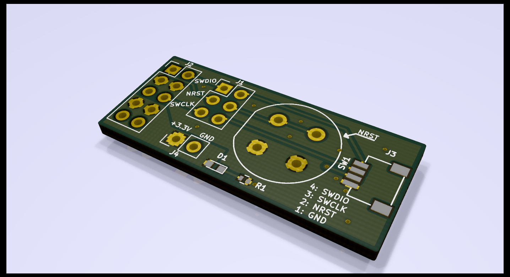

# STLink-v2 SWD Adapter

All of my projects use this tiny 4-pin JST-SH connector for their SWD and reset connection. I have been using a
dangling-wire adapter plugged into a breadboard, but that has started to break. This is a small (<1"sq) PCB which takes
the pinout from my STLink-v2 and just runs it out to a JST-SH connector and a reset button. I've added some header
options for rewiring the order of the pins if needed.

